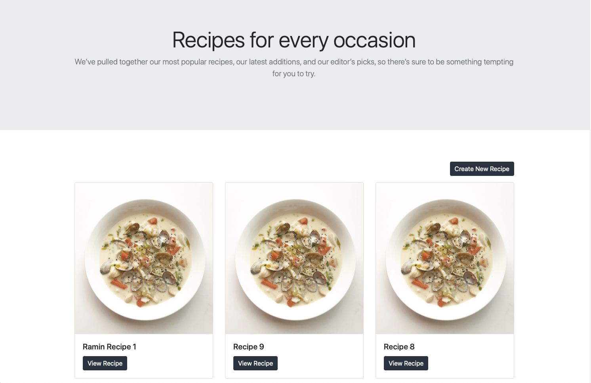

# Recipes Project with Ruby on Rails Project and a React Frontend

In this project, I created a Ruby on Rails application that stores 
your favorite recipes then displays them with a React frontend. User can create, view, and delete recipes from its profile. It is created with React and user interface is styled with Bootstrap.

## Milestones of the project.

- [x] Miltestone 1 - Creating a new Rails application
- [x] Miltestone 2 - Setting up the database
- [x] Miltestone 3 - Installing frontend dependencies
- [x] Miltestone 4 - Setting up the homepage
- [x] Miltestone 5 - Configuring React as Rails project frontend
- [x] Miltestone 6 - Creating the Recipe controller and model
- [x] Miltestone 7 - Viewing Recipes
- [x] Miltestone 8 - Creating Recipes
- [x] Miltestone 9 - Deleting Recipes
 
## Livedemo

- [Click Here]()

## Video presentation

- Soon will be here.

## Screenshot

<br>
Homepage component:



<br>
Recipe component:


<br>
NewRecipe component:


## Built With

- [Node.js](www.nodejs.org)
- [npm](https://www.npmjs.com/)
- [ES6](http://es6-features.org/) 
- [React](https://reactjs.org/)
- [React-DOM](https://reactjs.org/docs/react-dom.html)
- Ruby on Rails
- ActiveRecord 
- PostgreSQL
- webpacker
- CSS
- Heroku

### Setup

Clone the repo by typing

```
git clone https://github.com/RaminMammadzada/recipes-with-rails-react.git
```

Install packages with

```
  npm install
```

Start server with:

```
  npm start
```
Runs the app in the development mode.\
Open [http://localhost:3000](http://localhost:3000) to view it in the browser.


## Author

👤 **Ramin Mammadzada**

- Github: [@raminmammadzada](https://github.com/raminmammadzada)
- Twitter: [@raminmammadzada](https://twitter.com/raminmammadzada)
- Linkedin: [Ramin Mammadzada](https://www.linkedin.com/in/raminmammadzada/)

### Contributing

Contributions, issues and feature requests are welcome!

Feel free to check the [issues page](https://github.com/RaminMammadzada/recipes-with-rails-react/issues)

### Show your support

Give a star if you like this project!
